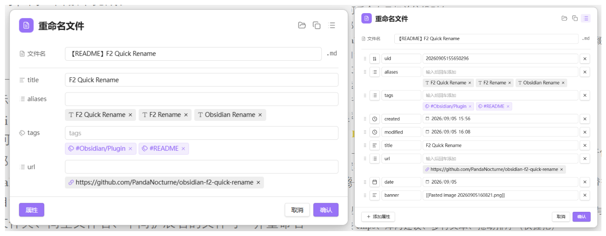

# F2 Quick Rename

[中文说明](./README.zh-CN.md)

Obsidian plugin for fast renaming: the current note, embeds under the cursor, and frontmatter properties in one panel.



## Features

### Rename

- **F2** — rename the current file, or the embed / link under the cursor
- Cursor on a heading — uses Obsidian’s built-in **Rename heading**
- Wiki embeds (`![[file|alias]]`) and markdown images (``) — rename the target and edit the alias
- External URLs — edit link URL and display title
- Excalidraw — edit the stem without `.excalidraw` / `.excalidraw.md`, restore on save
- Companion files (same folder, same basename, different extension) can be renamed together
- Optional: copy the new basename to the clipboard after renaming the active note
- File explorer context menu: **F2 Quick rename**
- Optional: double-click the extension suffix in the panel to edit it (off by default)

### Properties (F2 / F5)

- **F2** — show only properties configured in settings; you can add more for this session; the next open shows the configured set again (merge write; other frontmatter keys are kept)
- **F5** — full frontmatter panel (add / edit / delete / reorder / change type); replaces the whole frontmatter block
- Types aligned with Obsidian: text, list, number, checkbox, date, date & time
- List chips, vault suggestions, multiline text, drag reorder (grip only)
- Optional auto-save while the panel is open
- Optional **Collapse by default** for the properties section (F5 still opens expanded)

### Header tools

- **Show in folder** — `app.showInFolder` (desktop)
- **Copy wikilink** — shortest `[[wikilink]]`
- Header icon switches by file kind: note, Canvas, Excalidraw, Bases, attachment, link

### Language

Settings → **General** → **Language**:

- System default (follows Obsidian)
- 简体中文
- English

## Commands

| Command                        | Default hotkey |
| ------------------------------ | -------------- |
| Rename file or embed           | `F2`         |
| Rename and edit all properties | `F5`         |

Hotkeys can be changed under **Settings → Hotkeys**.

## Install

### Manual

1. Build or download `main.js`, `manifest.json`, and `styles.css`
2. Copy them to `<Vault>/.obsidian/plugins/f2-quick-rename/`
3. Enable **F2 Quick Rename** in **Settings → Community plugins**

### Develop

```bash
npm install
npm run dev
```

With [Hot Reload](https://github.com/pjeby/hot-reload), rebuilds apply automatically.

Production build:

```bash
npm run build
```

## Settings overview

- **General** — UI language
- **Feature toggles** — embeds, aliases, headings, companions, clipboard, properties, auto-save, edit extension
- **Document properties** — default collapse; configure fields, separators, and side-by-side rows for the F2 panel

## Privacy

Runs fully offline. No network requests, telemetry, or vault data uploaded.

## License

[BSD Zero Clause License (0BSD)](./LICENSE) — Copyright (C) 2026 by PandaNocturne.
